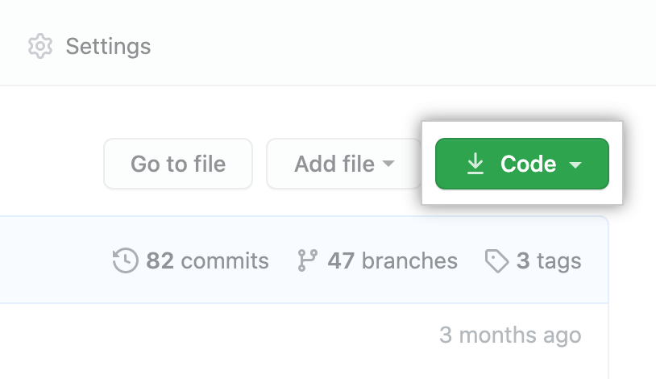

***

# Легкая и полезная Инструкиция по ипользованию GIT 
 
## GIT COMMAND

-  Первое что вы должгы сделать это    представиться Git при помощи этих    команд 
   - \<git config --global user.name 'ваше_имя' \> 
   - \<git config --global user.email 'адрес_почты@email.com' \>     

- далее  создаём репозиторий 
Для Linux и MacOS путь может выглядеть так :
  - /Users/UserName/Desktop/MyProject 
  - Для Windows например С://MyProject
 cd <путь_к_вашему_проекту>    
  - Инициализация/создание репозитория
\<git init\>
- теперь  git отслеживает изменения файлов вашего проекта

  - Но , так как вы  только создали репозиторий в нём нет вашего кода. 
  Для этого необходимо создать \<commit\>

- добавим все все файла проекта в будующий \<commit\>
    - \<git add .\>
    - если хотим добавить конкретный файл то можно так 
    \<git add 'имя_файла'\>
- теперь создаем \<commit\> Обязательно указываем комментарий.
И не забываем про кавычки 
  - \<git commit -m "комментарий"\>

-  во время работы не забывайте комитеть свой файл , а для того чтобы просмотреть ваш прогрес используйте команду \<git log\>
 
> После использования каманды  \<git log\>  Веруть терминал мы можем нажатием кнопки "q"

- Теперь перейдем к Азам Веток , чтобы создать ветку надо использовать команду :
   
   - \<git branch "имя_ветки"\>

- Для того чтобы переключиться на нашу новую ветку мы используем команду:
 
  - \<git checkout "имя_ветки"\>

- Для того чтобы создать ветку и сразу на неё перключиться мы будеи использовать эту команду 

  - \<git checkout -b "Имя_ветки"\>
  >используется команда checkout с ключом -b
    
### Работа с GitHub 
- Как клонировать чужой или свой репозиторий с GitHub
  - На GitHub.com перейдите на главную страницу репозитория. 1. Над списком файлов щелкните  Код. 
  - Скопируйте URL-адрес репозитория.enshot
  - Чтобы клонировать репозиторий с использованием HTTPS, в разделе "HTTPS" щелкните .
  - Чтобы клонировать репозиторий с использованием ключа SSH и включить сертификат, выданный центром сертификации SSH вашей организации, щелкните SSH, а затем щелкните .  
  -  Откройте GIT Bash. Измените текущий рабочий каталог на расположение, где должен находиться клонированный каталог. Введите git clone и вставьте URL-адрес, скопированный ранее.
- Команда \<git pull\> используется для извлечения и загрузки содержимого из удаленного репозитория и немедленного обновления локального репозитория этим содержимым.